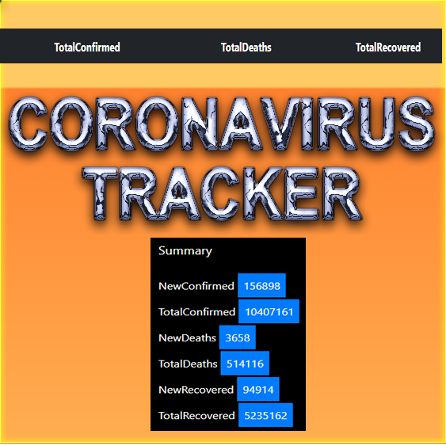

Dashboard to track the spread of the coronavirus.

[Tracker](https://shiny.john-coene.com/coronavirus) | [Docs](https://coronavirus.john-coene.com) | [API](https://coronavirus.john-coene.com/#/api) | [Changelog](NEWS.md)

## Technologies used

HTML, CSS, Bootstrap, Jquery, Javascript, Json

## How it works

This proyects connect to https://api.covid19api.com/summary API to obtain the data in real time.

## URL to try it

https://sezalazar.github.io/Covid-19AppTracker/

## How it was developed

Look at my video on Youtube: https://youtu.be/0TR3UtpytBo

